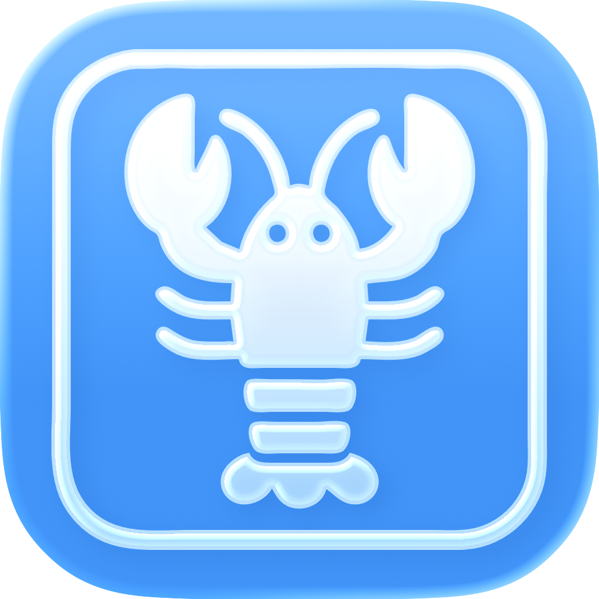
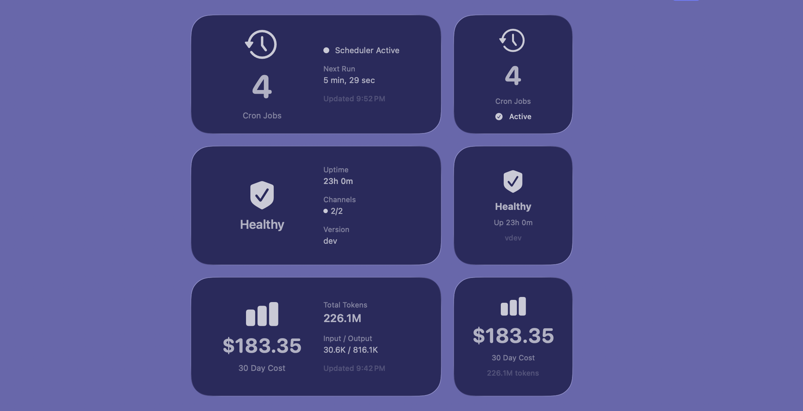

<p align="center">
  
</p>

<h1 align="center">Moltbot Widgets</h1>

<p align="center">
  <strong>macOS desktop widgets for monitoring your Moltbot gateway</strong>
</p>

<p align="center">
  <a href="https://github.com/851-labs/MoltbotWidgets/releases/latest">
    
  </a>
  
  
</p>

<p align="center">
  
</p>

## Widgets

| Widget | Description |
|--------|-------------|
| **Cron Jobs** | Scheduled task count and scheduler status |
| **Health** | Gateway status, uptime, version, and channel connectivity |
| **Usage** | 30-day API costs and token usage |

## Installation

### Homebrew

```bash
brew install --cask 851-labs/tap/moltbot-widgets
```

### Manual Download

1. Download `MoltbotWidgets.dmg` from the [latest release](https://github.com/851-labs/MoltbotWidgets/releases/latest)
2. Open the DMG and drag MoltbotWidgets to Applications
3. Launch MoltbotWidgets from Applications

## Setup

1. Configure your gateway connection:
   - **Host**: `127.0.0.1` (default for local)
   - **Port**: `18789` (default)
   - **Token**: Found in `~/.clawdbot/clawdbot.json` under `gateway.auth.token`
2. Click "Connect to Moltbot"
3. Add widgets to your desktop via Notification Center

> **Tip:** Widgets automatically read the gateway token from `~/.clawdbot/clawdbot.json` if available.

## Building from Source

```bash
git clone https://github.com/851-labs/MoltbotWidgets.git
cd MoltbotWidgets
open MoltbotWidgets.xcodeproj
# Build and run with ⌘R
```

## Requirements

- macOS 14.0+
- Moltbot gateway running locally or remotely
